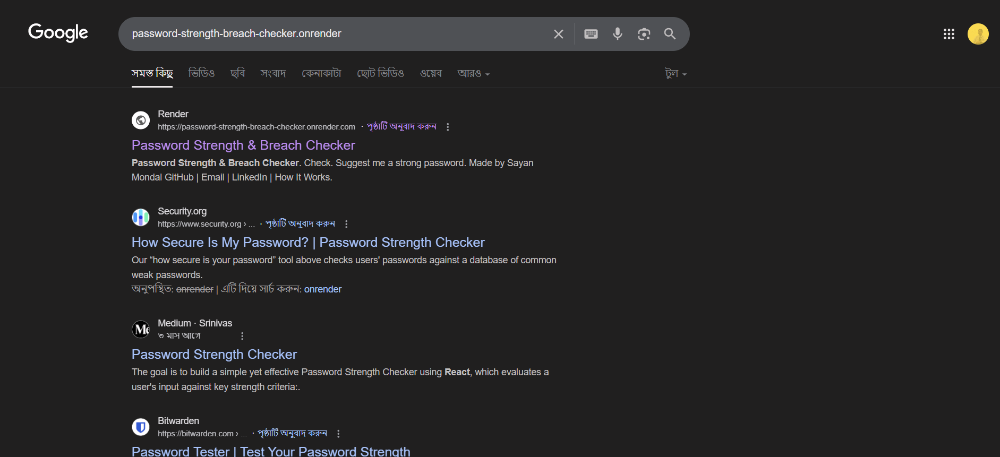

# 🔐 Password Strength & Breach Checker  

[](https://password-strength-breach-checker.onrender.com)  

A **Flask-based Web App** that helps users create secure passwords by:  

- ✅ Checking **password strength** using `zxcvbn`  
- ✅ Verifying against **Have I Been Pwned (HIBP) API** for breached passwords  
- ✅ Comparing with **rockyou.txt** (common password list)  
- ✅ Enforcing **custom password policy rules**  
- ✅ Suggesting **strong & random passwords**  

---

## 🛠️ Tech Stack  

- 🐍 Python  
- 🌐 Flask  
- 🎨 Bootstrap  
- 🔑 zxcvbn  
- 🛡️ HaveIBeenPwned API  
- 📄 HTML / CSS / JavaScript  

---

## 🚀 Getting Started  

### 🔧 Installation  

Clone this repo and install dependencies:  

```bash
git clone https://github.com/yourusername/password-checker.git
cd password-checker
pip install -r requirements.txt

▶️ Run the App
python app.py


Now visit 👉 http://127.0.0.1:5000 in your browser.

Or check the hosted version here:
👉 password-strength-breach-checker.onrender.com

📸 Screenshots
 

 
![Google Search]  

 
![Home Page]  


![How it works] 
 


👨‍💻 Developed By

Sayan Mondal
📧 Email: sm384008@gmail.com

🔗 LinkedIn: www.linkedin.com/in/sayan-mondal-386a31294

💻 GitHub: Sayan-8910

⭐ If you like this project, don’t forget to star the repo!


---


---

✅ Now your README has a **Live Demo button** at the top + direct hosted link inside 🚀.  

Do you also want me to add **badges** like `Made with Python`, `Flask`, and `Deployed on Render` at the top for extra attractiveness?
